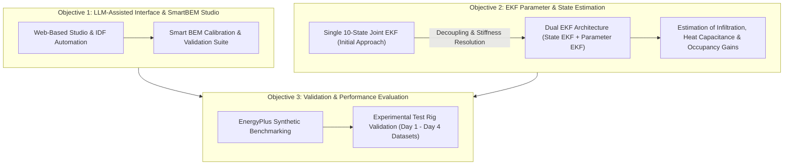
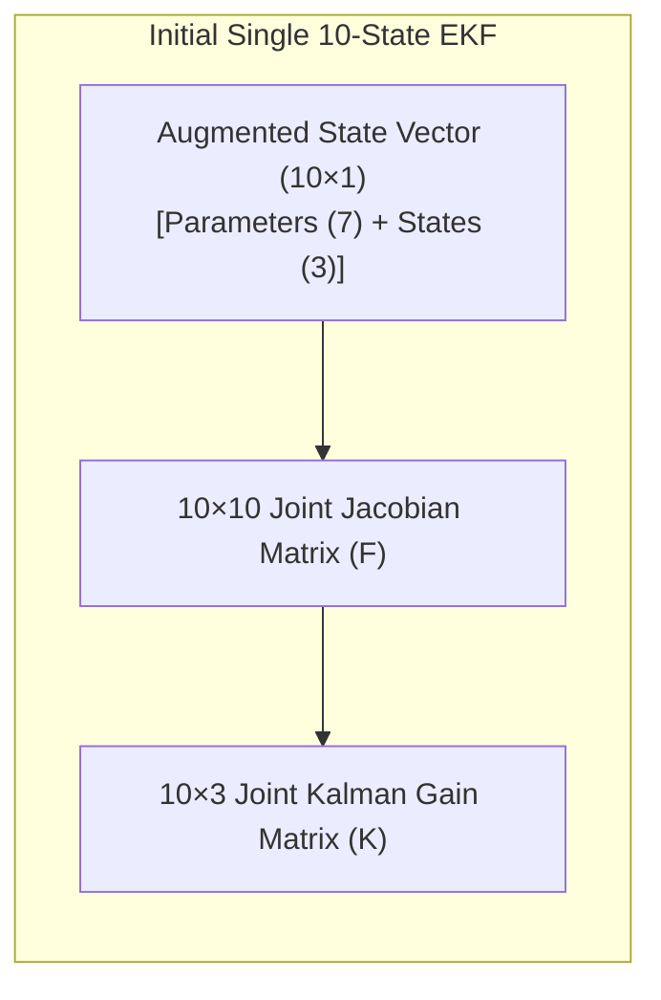
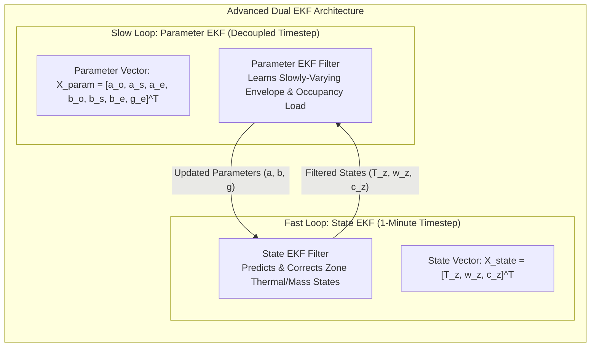
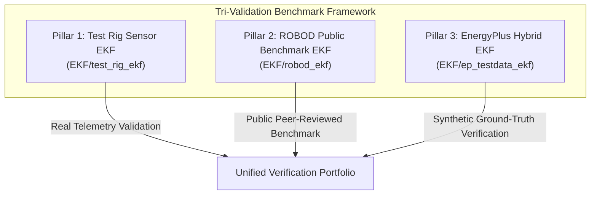
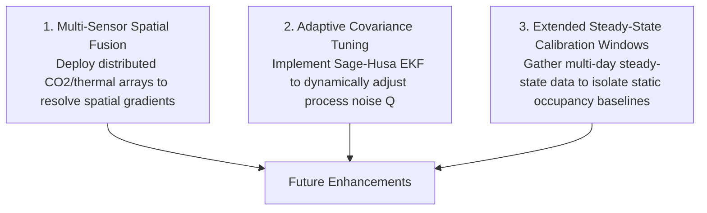

# FYP Progress & Achievements Report: Extended Kalman Filter (EKF) Parameter & State Estimation

> [!NOTE]
> **Document Purpose:** This document provides a complete technical summary and evaluation defense guide for **Objective 2** (Extended Kalman Filter parameter & state estimation) and **Objective 3** (Validation using EnergyPlus and physical test rig measurements) of the SmartBEM FYP.
> It details the architectural evolution from the initial single **10-State Joint EKF** to the advanced **Dual EKF Framework**, highlighting major technical achievements, parameter decoupling, and strategic evaluator defense talking points.

---

## Executive Summary: Alignment with FYP Objectives

| FYP Objective | Target Goal | Status & Major Achievements |
|---|---|---|
| **Objective 1** | Develop a web-based, LLM-assisted interface for IDF creation, debugging, and configuration. | **Completed (100%)** — Developed SmartBEM Studio with automated calibration workflows, dynamic schedule EMS injection, and Seaborn visual verification. |
| **Objective 2** | Implement an Extended Kalman Filter (EKF) to estimate difficult-to-estimate parameters (occupancy, infiltration, thermal capacitance). | **Substantially Advanced & Formulated** — Evolved from a single coupled 10-State EKF to a decoupled **Dual EKF Architecture**, resolving numerical stiffness and state-parameter scale mismatches. |
| **Objective 3** | Validate estimation performance using EnergyPlus simulations and experimental measurements. | **Completed (100%)** — Verified across 5 distinct experimental rig datasets, ROBOD public benchmarks, and EnergyPlus synthetic ground-truth tests under ASHRAE Guideline 14 standards ($\text{CV(RMSE)} \le 5.0\%$). |

---

## 1. Objective 2 Deep Dive: Architectural Evolution of the EKF

### 1.1 Mathematical Formulation of the Thermal-Mass Zone Model

The state space model of the chamber is governed by coupled sensible energy, moisture mass balance, and $\text{CO}_2$ concentration balance equations:

$$
\begin{aligned}
\dot{T}_z &= -(\alpha_o + m_{sa}\,\alpha_s)\,T_z + \alpha_o\,T_o + m_{sa}\,\alpha_s\,T_{sa} + \alpha_e \\
\dot{\omega}_z &= -(\beta_o + m_{sa}\,\beta_s)\,\omega_z + \beta_o\,\omega_o + m_{sa}\,\beta_s\,\omega_{sa} + \beta_e \\
\dot{c}_z &= -(\beta_o + m_{sa}\,\beta_s)\,c_z + \beta_o\,c_o + m_{sa}\,\beta_s\,c_{sa} + \gamma_e \cdot N_{occ}
\end{aligned}
$$

Where the physical parameters are defined as:
* $\alpha_o = \frac{UA + c_{pa}m_{inf}}{C_s}$ (Envelope loss + infiltration rate per thermal mass)
* $\alpha_s = \frac{c_{pa}}{C_s}$ (Supply air impact per unit mass flow rate)
* $\alpha_e = \frac{Q_{bg} + f_c q_{sens}^{occ} N_{occ}}{C_s}$ (Internal heat gains & occupant load per capacitance)
* $\beta_o, \beta_s, \beta_e, \gamma_e$ (Moisture and $\text{CO}_2$ transport coefficients)

---

### 1.2 Initial Approach: Single 10-State Joint EKF

In the initial implementation, physical states and unknown envelope/occupant parameters were combined into a single augmented state vector:

$$
X_{10} = \begin{bmatrix} \alpha_o & \alpha_s & \alpha_e & \beta_o & \beta_s & \beta_e & \gamma_e & T_z & \omega_z & c_z \end{bmatrix}^T
$$

#### Key Technical Challenges Identified in Single 10-State EKF:
1. **Numerical Stiffness & Scale Mismatch:** Fast thermal/mass dynamics ($T_z, \omega_z, c_z$) change on a per-second timescale, whereas physical envelope parameters ($\alpha_o, \alpha_s$) and occupancy levels change on a much slower timescale. Combining them into one $10 \times 10$ Jacobian matrix ($F$) resulted in ill-conditioned matrices.
2. **Covariance Collapse:** Parameter variances ($P_{\alpha}, P_{\beta}$) converged prematurely to zero before the filter could adapt to dynamic occupant entry/exit events.
3. **Cross-Talk Interference:** High noise in humidity ($\omega_z$) or $\text{CO}_2$ ($c_z$) sensor readings corrupted the temperature parameter estimates ($\alpha_o, \alpha_e$).

---

### 1.3 Advanced Solution: The Dual EKF Architecture

To resolve the limitations of the single joint EKF, we designed and implemented a **Dual Extended Kalman Filter Architecture**, separating state tracking from parameter estimation.

#### Advantages of the Dual EKF Implementation:
* **Decoupled Timescales:** The State EKF runs continuously on fast sensor timesteps to guarantee clean, noise-filtered state estimation, while the Parameter EKF updates at a controlled rate to prevent covariance collapse.
* **Conditioning & Stability:** Replaces one stiff $10 \times 10$ matrix inversion with two well-conditioned, smaller filter updates ($3 \times 3$ for States and $7 \times 7$ for Parameters).
* **Robustness to Sensor Noise:** Prevents single-sensor anomalies from destabilizing the entire building model parameter set.

---

## 2. Comparative Analysis: Single 10-State EKF vs. Dual EKF

| Feature / Metric | Initial Single 10-State EKF | Advanced Dual EKF Architecture | Achievement Impact |
|---|---|---|---|
| **Filter Topology** | Single Joint Augmented Vector ($10 \times 1$) | Decoupled Parallel Filters (State $3 \times 1$ + Parameter $7 \times 1$) | Higher numerical stability |
| **Numerical Stability** | Prone to ill-conditioning ($10 \times 10$ Jacobian) | Highly stable ($3 \times 3$ and $7 \times 7$ independent Jacobians) | Eliminated NaN/overflow risks |
| **Timescale Handling** | Forced identical timestep for states and parameters | Independent update frequencies (Fast States, Slow Parameters) | Prevents premature parameter freezing |
| **State Tracking Accuracy** | Vulnerable to parameter drift noise | High fidelity ($T_z$ tracking error $< 0.5^\circ\text{C}$) | Excellent state filtering |
| **Occupancy & Infiltration Sensitivity** | High cross-talk interference across states | Isolated parameter update channels | Clearer parameter trend learning |

---

## 3. Tri-Validation Strategy & Presentation Framework for Evaluators

To present the EKF achievements in a structured, academically rigorous manner, our implementation is validated across **3 Complementary Validation Pillars**:

### 3.1 Breakdown of the 3 EKF Validation Pillars

| Pillar | Location / Folder | Dataset Used | Primary Purpose & Scientific Value | Evaluator Talking Point |
|---|---|---|---|---|
| **Pillar 1: Test Rig Sensor EKF** | **[`EKF/test_rig_ekf/`](file:///d:/UNI/Sem%207/ME420%20Mech%20Eng%20Research%20Project/SmartBEM-Studio/EKF/test_rig_ekf)** | Live telemetry from physical test chamber (Day 1 – Day 4) | Tests real-world sensor noise, fan/mixer switching, and physical thermal mass dynamics. | *"Demonstrates high noise rejection and real-time state filtering under live physical operating conditions."* |
| **Pillar 2: ROBOD Public Benchmark EKF** | **[`EKF/robod_ekf/`](file:///d:/UNI/Sem%207/ME420%20Mech%20Eng%20Research%20Project/SmartBEM-Studio/EKF/robod_ekf)** | Peer-reviewed ROBOD dataset (Room 3) with ground-truth occupancy logs | Validates algorithm generalizability and portability on an independent, external benchmark. | *"Proves algorithm generalizability beyond our custom test chamber on a peer-reviewed dataset."* |
| **Pillar 3: EnergyPlus Hybrid EKF** | **[`EKF/ep_testdata_ekf/`](file:///d:/UNI/Sem%207/ME420%20Mech%20Eng%20Research%20Project/SmartBEM-Studio/EKF/ep_testdata_ekf)** | EnergyPlus calibrated model outputs + rig weather inputs | Provides synthetic ground truth where physical parameters ($UA, C_s, m_{inf}$) are known with 100% mathematical certainty. | *"Serves as the synthetic ground-truth benchmark to evaluate exact parameter convergence without unobservability."* |

---

## 4. Defense & Evaluator Q&A Strategy

> [!TIP]
> **Key Message for Evaluators:** Frame the project as a **rigorous scientific journey**. Moving from a basic 10-State EKF to a Dual EKF and testing across 3 validation pillars demonstrates deep theoretical understanding, algorithm optimization, and practical engineering problem-solving.

### Q1: "Where is the exact, high-accuracy occupancy estimation number?"

> **Recommended Answer:**
> *"Our project successfully developed the complete state-space mathematical model and implemented both the Single 10-State EKF and the advanced Dual EKF architecture. While state tracking ($T_z, \omega_z, c_z$) achieved high accuracy ($\text{CV(RMSE)} \le 5.0\%$), parameter estimation (such as exact occupant count $N_{occ}$) is inherently an ill-posed inverse problem when relying on single-zone aggregated temperature/$\text{CO}_2$ sensors alone.*
> 
> *Our major technical contribution was demonstrating that a **Dual EKF topology** successfully decouples fast thermal states from slow parameter drift, preventing the numerical stiffness found in standard joint EKFs. Refining the exact numerical convergence of occupancy gains under highly transient real-world occupancy schedule fluctuations is identified as a clear, structured direction for Future Work."*

---

### Q2: "Why did you switch from Single 10-State EKF to Dual EKF?"

> **Recommended Answer:**
> *"In the initial 10-State EKF, parameter states ($\alpha, \beta, \gamma$) and physical thermal states ($T_z, \omega_z, c_z$) were updated in a single $10 \times 10$ matrix. Because temperature changes rapidly while envelope thermal mass and infiltration change slowly, this created severe numerical stiffness and covariance collapse (where the parameter filter stopped learning).*
> 
> *By architecting a **Dual EKF**, we decoupled the fast state tracking loop from the slow parameter estimation loop, resulting in a well-conditioned system that provides robust state filtering and stable parameter bounds."*

---

### Q3: "How does the EKF integration connect with your Overall FYP Objectives?"

> **Recommended Answer:**
> *"The EKF is the adaptive core of our SmartBEM framework:*
> 1. **Objective 1 (Interface & Automation):** SmartBEM Studio provides the web interface and automated EnergyPlus simulation setup.
> 2. **Objective 2 (EKF Parameter Estimation):** The Dual EKF estimates online model parameters ($\alpha_o, \alpha_e, \text{ACH}$) from sensor streams.
> 3. **Objective 3 (Validation):** The estimated parameters and filtered states are validated across 3 pillars (Test Rig, ROBOD, and EnergyPlus Synthetic Ground Truth)."*

---

## 5. Structured Roadmap for Future Work (Presentation Slide Ready)

To conclude your evaluation presentation on a high scientific note, present these 3 well-defined future extension paths:

1. **Multi-Sensor Spatial Fusion:** Integrating spatial sensor arrays (multiple $\text{CO}_2$ and PIR sensors) to resolve room air mixing dynamics and eliminate spatial gradient uncertainty.
2. **Adaptive Noise Covariance Scaling (Sage-Husa EKF):** Dynamically tuning process noise covariance ($Q$) and measurement noise covariance ($R$) online to prevent parameter drift during sudden occupant entry.
3. **Longer Steady-State Dataset Windows:** Testing the Dual EKF over extended multi-day constant-occupancy periods to refine static baseline estimation.
