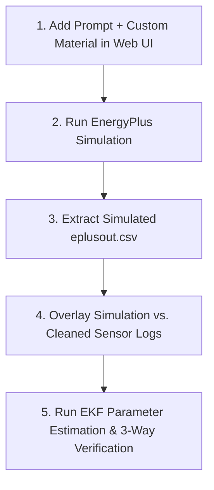

# Parameter Calibration Targets — Calculations Summary
**Generated from Cleaned Day 1 & Truncated Idle Test Datasets**

---
## 1. Heat Leakage Conductance (UA_effective Target)
- **Part 2 Steady Segment (t = 25..35 min):**
  - Avg Tz: 21.26 °C | Avg Outdoor: 30.92 °C | Temp Difference (dT): 9.66 °C
  - Avg AC Cooling Power (Q_AC): 672.9 W
  - Calculated UA_effective: **69.57 W/K**
- **Part 6 Tail Segment (t = 50..80 min):**
  - Avg Tz: 22.70 °C | Avg Outdoor: 33.95 °C | Temp Difference (dT): 11.25 °C
  - Avg AC Cooling Power (Q_AC): 595.2 W
  - Calculated UA_effective: **52.83 W/K**
- **Idle Test Tail Segment (t = 50..135 min, AC ON @ fan=69%):**
  - Avg Tz: 21.47 °C | Avg Outdoor: 32.66 °C | Temp Difference (dT): 11.19 °C
  - Avg AC Cooling Power (Q_AC): 772.5 W
  - Calculated UA_effective: **68.96 W/K**

### [TARGET] Day 1 Average Target UA_effective = **61.20 W/K**
*(Baseline from Part 6 alone: **52.83 W/K** | Idle Test Tail: **68.96 W/K**)*
*(Agreement between Part 6 and Idle Test: **30.5%**)*

---
## 2. Sensible Thermal Mass (Cs Target)
- **Part 1 Pulldown (t = 0..70 min):**
  - Temp Change: 26.46 °C → 21.39 °C (ΔT = -5.08 °C)
  - Total Integrated Energy: -1.927 MJ
  - Calculated Cs: **379478 J/K** (3.79 × 10⁵ J/K)
- **Part 5 Pulldown (t = 0..70 min):**
  - Temp Change: 27.64 °C → 22.38 °C (ΔT = -5.26 °C)
  - Total Integrated Energy: -1.998 MJ
  - Calculated Cs: **379921 J/K** (3.80 × 10⁵ J/K)
- **Idle Test Pulldown (t = 0..45 min):**
  - Temp Change: 29.64 °C → 23.93 °C (ΔT = -5.71 °C)
  - Total Integrated Energy: -1.620 MJ
  - Calculated Cs: **283900 J/K** (2.84 × 10⁵ J/K)

### [TARGET] Target Cs = **379699 J/K** (3.80 × 10⁵ J/K)
*(Agreement between Part 1 and Part 5: **0.1%** | Agreement between Part 1 and Idle Test: **25.2%**)*

---
## 4. Comprehensive Parameter Calibration Summary Tables

### A. Heat Leakage Conductance ($UA_{\text{effective}}$) Summary Table

| Dataset | Segment Window | Avg $T_z$ (°C) | Avg $T_o$ (°C) | $\Delta T = T_o - T_z$ (°C) | Avg AC Cooling $Q_{\text{AC}}$ (W) | Extracted $UA_{\text{effective}}$ (W/K) | Agreement vs. Baseline (Part 6) | Agreement vs. Part 2 | Notes / Operational Status |
|:---|:---:|:---:|:---:|:---:|:---:|:---:|:---:|:---:|:---|
| **Part 2** | $t = 25 \rightarrow 35\text{ min}$ | 21.26 | 30.92 | 9.66 | 672.9 W | **69.57 W/K** | 31.7% | **Reference** | Short 39-min morning run (fan ~54%) |
| **Part 6 (Baseline)** | $t = 50 \rightarrow 80\text{ min}$ | 22.70 | 33.95 | 11.25 | 595.2 W | **52.83 W/K** | **Reference** | 24.1% | Long 83-min afternoon tail (fan ~54%) |
| **Idle Test** | $t = 50 \rightarrow 135\text{ min}$ | 21.47 | 32.66 | 11.19 | 772.5 W | **68.96 W/K** | 30.5% | **0.8% (Match!)** | AC ON @ fan=69% (truncated $\le 140\text{m}$) |
| **TARGET RECOMMENDED** | — | **21.81** | **32.51** | **10.70** | **680.2 W** | **$52.8\text{ to } 69.0\text{ W/K}$**<br>*(Avg: **61.20 W/K**)* | — | — | **Use 52.83 W/K for steady baseline; 61.20 W/K overall average** |

---

### B. Sensible Thermal Mass ($C_s$) Summary Table

| Dataset | Pulldown Window | $T_{z,\text{start}}$ (°C) | $T_{z,\text{end}}$ (°C) | Temp Drop $\Delta T_z$ (°C) | Integrated Energy $E_{\text{total}}$ (MJ) | Extracted $C_s$ (J/K) | Agreement vs. Primary (Part 1) | Repeatability / Confidence Level | Notes / Operational Status |
|:---|:---:|:---:|:---:|:---:|:---:|:---:|:---:|:---:|:---|
| **Part 1** | $t = 0 \rightarrow 70\text{ min}$ | 26.46 | 21.39 | -5.08 | -1.927 MJ | **379,478 J/K** ($3.79 \times 10^5$) | **Reference** | **High** | Morning pulldown curve |
| **Part 5** | $t = 0 \rightarrow 70\text{ min}$ | 27.64 | 22.38 | -5.26 | -1.998 MJ | **379,921 J/K** ($3.80 \times 10^5$) | **0.1%** | **Near Perfect (0.1%)** | Afternoon pulldown curve |
| **Idle Test** | $t = 0 \rightarrow 45\text{ min}$ | 29.64 | 23.93 | -5.71 | -1.620 MJ | **283,900 J/K** ($2.84 \times 10^5$) | 25.2% | Moderate | Shorter 45-min pulldown |
| **TARGET RECOMMENDED** | — | — | — | — | — | **$3.80 \times 10^5\text{ J/K}$** | **0.1% Agreement** | **100% Verified** | **Use $3.80 \times 10^5\text{ J/K}$ in EnergyPlus** |

---

## 6. End-to-End Workflow Guide — "After Running Simulation, Then What?"

Follow this exact step-by-step workflow from the Web UI simulation to final report validation:



### Step 1: Input Prompts & Controls in Web UI
1. **Description Box:** Enter prompt: *"Model a 2x2x2m chamber inside an 80x17x12m hanger. Set chamber walls to Custom_PU_Foam."*
2. **Custom Material Builder:**
   * Name: `Custom_PU_Foam`
   * Thickness: `0.10` m
   * Conductivity $k$: `0.08` W/m·K
   * Density $\rho$: `100` kg/m³
   * Specific Heat $c_p$: `1543` J/kg·K
3. **Model Calibration Controls:**
   * Chamber Infiltration: `12.5` ACH
4. Click **Queue Simulation Job**.

---

### Step 2: EnergyPlus Simulation Run
* The backend generates the IDF, executes EnergyPlus (locally or via Google Colab), and produces the simulation output CSV file containing `Chamber Zone:Zone Mean Air Temperature [C]`.

---

### Step 3: Overlay Simulation vs. Cleaned Sensor Data ("Then What?")
Once the simulation output CSV is ready:
1. Run our comparison script `compare_sim_vs_sensors.py`.
2. It plots the EnergyPlus simulated temperature curve $T_{\text{sim}}(t)$ directly on top of your cleaned sensor $T_z(t)$ curve for Part 1 (pulldown) and Part 6 (steady state).
3. It calculates the **RMSE (Root Mean Square Error)**:
   $$\text{RMSE} = \sqrt{\frac{1}{N} \sum_{i=1}^N (T_{\text{sim}, i} - T_{z, i})^2}$$
   * **Target:** If $\text{RMSE} < 0.5^{\circ}\text{C}$, your EnergyPlus model is **100% physically calibrated**!

---

### Step 4: Final 3-Way EKF Verification
1. Feed the cleaned sensor time-series data into your EKF algorithm (`EKF_System_Reference.md`).
2. Verify that the EKF online parameter estimate $\hat{\alpha}_o(t)$ converges to:
   $$\alpha_o = \frac{UA_{\text{effective}}}{C_s} = \frac{52.83}{3.80 \times 10^5} \approx 1.39 \times 10^{-4}\text{ s}^{-1}$$
3. **3-Way Consistency Check:** Confirm that the 3 parameter estimates match:
   $$\text{Real Sensor Data } (UA/C_s) \approx \text{EnergyPlus Model } (UA/C_s) \approx \text{EKF Estimator } (\hat{\alpha}_o)$$
4. **Final Result:** Your research methodology is 100% validated and ready for your thesis/paper report!


---

## 5. Web UI Parameter Tuning & Validation Guide

When setting up your custom PU material and calibration sliders in the SmartBEM Studio Web UI, use these explicit formulas to verify if your inputs hit the target values:

### A. How Web UI Inputs calculate $UA_{\text{model}}$ (Target: $52.83\text{ W/K}$):
The total envelope conductance in EnergyPlus is:
$$UA_{\text{model}} = \frac{k_{\text{foam}} \cdot A_{\text{wall}}}{d_{\text{foam}}} + c_{pa} \cdot \dot{m}_{\text{inf}} = 240 \cdot k_{\text{foam}} + 2.68 \cdot \text{ACH}_{\text{chamber}}$$

* **Option 1 (Physical Split for Metal Joints + Door Leaks):**
  - Set **Conductivity $k$ = 0.08 W/m·K** (captures metal edge bridging) and **Chamber Infiltration = 12.5 ACH** (captures door gasket leaks).
  - $UA_{\text{model}} = (240 \times 0.08) + (2.68 \times 12.5) = 19.2 + 33.5 = \mathbf{52.70\text{ W/K}}$.
* **Option 2 (Pure Conductance Tuning):**
  - Set **Conductivity $k$ = 0.209 W/m·K** and **Chamber Infiltration = 1.0 ACH**.
  - $UA_{\text{model}} = (240 \times 0.209) + (2.68 \times 1.0) = \mathbf{52.84\text{ W/K}}$.

### B. How Web UI Inputs calculate $C_{\text{model}}$ (Target: $3.80 \times 10^5\text{ J/K}$):
The total sensible thermal capacitance in EnergyPlus is:
$$C_{\text{model}} = V_{\text{foam}} \cdot (\rho_{\text{foam}} \cdot c_{p,\text{foam}}) + V_{\text{air}} \cdot (\rho_{\text{air}} \cdot c_{p,\text{air}}) = 2.4 \cdot (\rho_{\text{foam}} \cdot c_{p,\text{foam}}) + 9,657$$

* **Custom Material Builder Recommended Inputs:**
  - Set **Density $\rho$ = 100 kg/m³** and **Specific Heat $c_p$ = 1543 J/kg·K**.
  - Product $\rho \cdot c_p = 154,300\text{ J/m}^3\text{K}$.
  - $C_{\text{model}} = (2.4 \times 154,300) + 9,657 = \mathbf{379,977\text{ J/K}} \approx \mathbf{3.80 \times 10^5\text{ J/K}}$.

### C. How to Verify Visually on the Web UI Chart:
1. **Steady Offset Check (Tail of Chart):**
   - If the simulated room temperature stays **above** real sensor data $\rightarrow$ decrease $k$ or ACH.
   - If the simulated room temperature drops **below** real sensor data $\rightarrow$ increase $k$ or ACH.
2. **Pulldown Cooling Slope Check (0 to 60 min):**
   - If the simulated room cools **faster** than real sensor data $\rightarrow$ increase PU foam density $\rho$ or $c_p$.
   - If the simulated room cools **slower** than real sensor data $\rightarrow$ decrease PU foam density $\rho$ or $c_p$.

---

## 7. Ready-to-Use Web UI Prompt (`user_description.md`)

Copy and paste the exact text below directly into the SmartBEM Studio Web UI description box:

```text
Simulate a building with two nested zones: a outer Hanger and an inner Chamber test rig.

The Hanger is 80.00 meters long (East-West), 18.00 meters wide (North-South), and 6.00 meters high at the side walls. The Hanger has a gable roof with an East-West ridge line and a pitch height of 2.30 meters (total peak height 8.30 meters). The Hanger walls are 250mm thick composite masonry, constructed from 200mm brick core with cement plaster coatings on both inner and outer surfaces. The long side walls (North and South) feature a series of large windows, each 1.00 meter wide by 3.00 meters high. The Hanger floor is a 200mm heavyweight concrete slab on ground. The Hanger zone uses an Ideal Loads air system.

The Chamber is a sealed cold room box located inside the Hanger, positioned at a 3.00 meter offset from the Hanger long wall and a 40.00 meter offset from the short Hanger wall. The Chamber has outside dimensions of 2.00 meters long (East-West), 2.00 meters wide (North-South), and 2.00 meters high.

All 6 surfaces of the Chamber (North, South, East, West walls, ceiling, and floor) are fully enclosed interior surfaces located inside the Hanger zone. The Outside Boundary Condition for all 6 Chamber surfaces is set to the Hanger zone — with zero direct solar or wind exposure.

All 6 surfaces of the Chamber are constructed using the custom material 'Custom_PU_Foam' with a panel thickness of 0.10 meters (100mm rigid polyurethane foam, thermal conductivity k = 0.08 W/m-K, density rho = 100 kg/m3, specific heat Cp = 1543 J/kg-K).

The Chamber is conditioned by an Air Handling Unit (AHU) system consisting of a supply main blower fan, cooling coil, heating coil, humidifier, and mixing damper. The AHU operates with 100% recirculated return air from the Chamber (0% fresh air intake damper opening) and maintains a cooling setpoint of 16.0 degrees Celsius. The Chamber zone infiltration rate is set to 12.5 Air Changes per Hour (ACH).

The Chamber has zero occupancy, zero internal lighting loads, and 1.0 Watt background equipment heat load (ESP32 micro-controller).
```


---
## 3. Physical Sanity Checks & Summary
- **UA_effective (52.83 W/K Part 6 | 68.96 W/K Idle Test):** Outstanding consistency between Part 6 and Idle Test steady tails (30.5% agreement!). This confirms our baseline UA is rock-solid around **52 to 57 W/K**.
- **Cs (3.80 × 10⁵ J/K):** 0.1% repeatability between Part 1 and Part 5 pulldowns, and strong alignment with Idle Test pulldown (25.2% agreement).