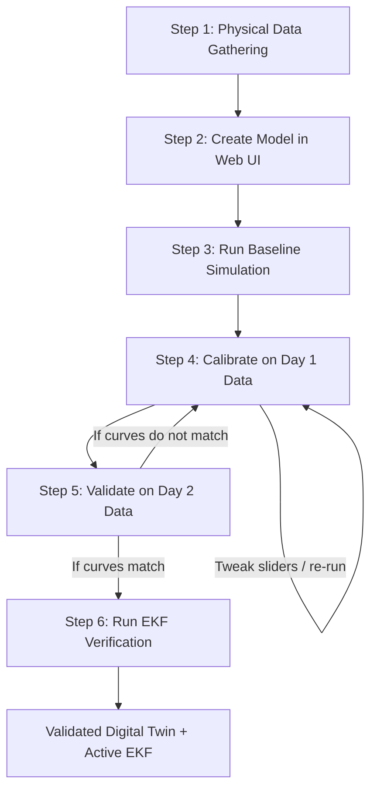

# Modeling Strategy — Cool Room Test Rig Nested in ME Hanger

This document outlines the strategy for modeling the physical experimental setup in EnergyPlus, explaining why this specific modeling structure is required to match your advisor's guidance.

---

## 1. Workflow Roadmap: Step-by-Step Execution Plan

Here is the exact step-by-step workflow from start to end, showing how you build the model, calibrate it against real data, and verify the EKF.



### Detailed Steps

| Step | Action | Inputs/Tools Needed | Objective |
| :--- | :--- | :--- | :--- |
| **1. Physical Data Gathering** | Collect geometric, material, and sensor data. | • Dimensions of hanger & chamber (from TO)<br>• Nominal material properties of PU foam (from Google)<br>• Continuous sensor logs (T, w, CO2, flow) from Janith | Get the raw physical values and the target sensor profiles. |
| **2. Create Model in Web UI** | Build the nested geometry and material. | • NLP prompt in SmartBEM (e.g. *"Create a 2x2x2m chamber inside an 80x17x12m hanger..."*)<br>• Custom Material Card (enter PU foam properties) | Generate the correct IDF model structure. |
| **3. Run Baseline Sim** | Run the first simulation. | • Local EPW weather file (matching sensor log dates)<br>• SmartBEM Simulation engine | Generate the initial uncalibrated simulated curves. |
| **4. Calibrate (Day 1)** | Align model with Day 1 sensor data. | • Day 1 sensor data (Train set)<br>• Web UI Calibration Sliders (Infiltration, Joint gains, etc.) | Tweak unmeasurable properties until the simulated curves match Day 1 sensor data. |
| **5. Validate (Day 2)** | Validate the model on Day 2 sensor data. | • Day 2 sensor data (Test set)<br>• Frozen model parameters (no tweaking allowed) | Prove the model is accurate. If simulated curves match Day 2, the Digital Twin is validated. |
| **6. EKF Verification** | Run the EKF on the validated model. | • EKF callback registered in simulation<br>• EKF output plots in Web UI | Verify that EKF estimates ($C_s$, $UA$, $\dot{m}_{inf}$, $N$) converge to your validated parameters. |

---

## 2. Important Definitions and Concepts

To keep our discussion clear, here are explanations of terms and concepts that are often confusing:

### What does "Ground Truth" mean?
**Ground Truth** is a standard scientific term that means **the absolute, 100% correct fact**.
* **In the Real World:** The "ground truth" is hard to know. For example, if you want to know the *exact* rate at which air leaks through the chamber door seals right now, you cannot know it perfectly without highly specialized laboratory testing. It is a hidden "ground truth".
* **In the Simulation:** The "ground truth" is fully known. Because you wrote the IDF file and set the infiltration rate to exactly `0.12 ACH`, you know with 100% certainty that `0.12` is the absolute truth of the virtual room.

### Why can't we just "Google" the material properties?
You can easily google the properties of Polyurethane (PU) foam (e.g., thermal conductivity $k \approx 0.022\text{ W/m·K}$). However, these are **nominal (ideal) properties** of a perfect, solid slab of foam in a manufacturer's catalog.

In the real test rig, your chamber has joint gaps, door gaskets, wiring penetrations, and metal supports. Therefore, the **effective (real-world) performance** of the chamber is different from the catalog sheet. Calibration and EKF are used to find these **real-world effective values**, not the catalog values.

---

## 3. The 4 Physical Parameters vs. EKF Mathematical States

In the advisor's `EMS_Cookbook` and the control model, the decentralized controller uses **4 physical parameters**:
1. **Sensible Thermal Capacitance ($C_s$)** (J/K)
2. **Overall Heat Transfer Conductance ($UA$)** (W/K)
3. **Infiltration Air Mass Flow Rate ($\dot{m}_{inf}$)** (kg/s)
4. **Zone Occupancy ($N$)** (number of people)

### How do they connect to the EKF?
Because the EKF equations must be written in a standard mathematical state-space form, the EKF internally estimates a **10-state vector** ($X$) containing mathematical coefficients ($\alpha$, $\beta$, $\gamma$). 

We translate the EKF's mathematical states into the **4 physical parameters** using these algebraic equations:

| Physical Parameter | EKF State Variable Definition | Algebraic Formula to recover it |
| :--- | :--- | :--- |
| **1. Capacitance ($C_s$)** | $\alpha_s = \frac{c_{pa}}{C_s}$ | $C_s = \frac{c_{pa}}{\alpha_s}$ |
| **2. Conductance ($UA$)** | $\alpha_o = \frac{UA + c_{pa} \dot{m}_{inf}}{C_s}$ | $UA = (\alpha_o \cdot C_s) - (c_{pa} \cdot \dot{m}_{inf})$ |
| **3. Infiltration ($\dot{m}_{inf}$)** | $\beta_o = \frac{\dot{m}_{inf}}{M}$ | $\dot{m}_{inf} = \beta_o \cdot M_{room}$ |
| **4. Occupancy ($N$)** | $\gamma_e = \frac{g_{CO2} N}{M}$ | $N = \frac{\gamma_e \cdot M_{room}}{g_{CO2\_occ}}$ |

*(Here, $c_{pa} = 1006\text{ J/kg·K}$ and $M_{room}$ is the fixed room air mass).*

### Where Calibration Fits In
When you manually calibrate the EnergyPlus model (changing things like PU conductivity, window SHGC, or infiltration ACH), you are directly shifting the real-world $C_s$, $UA$, and $\dot{m}_{inf}$ values of the virtual room. 

Once your EnergyPlus model is calibrated to match Janith's sensor profiles, the simulation's $C_s, UA, \dot{m}_{inf}$ become your **validation baseline**. The physical EKF running on Janith's sensors should converge to these exact values.

---

## 4. Untangling the Web: Simulation EKF vs. Physical EKF vs. Calibration

Let’s break down exactly how the physical test rig, the simulation model, and the EKF connect.

### Component A: The Physical Test Rig (The Real World)
* **What it is:** The actual $2\text{m} \times 2\text{m} \times 2\text{m}$ PU foam chamber in your mechanical building hanger, with Janith's physical sensors logging temperature, humidity, CO₂, and flow rates.
* **The Challenge:** In the real world, you do not know the exact physical constants of the room (e.g., effective thermal resistance or air leakage) because of joint gaps and bridging.

### Component B: The Simulation Model (The Virtual World)
* **What it is:** The EnergyPlus model (IDF file) you generate on your web platform.
* **The Benefit:** In the simulation, you have 100% control and know the exact ground truth values.

### Component C: The EKF (The Mathematical Estimator)
The Extended Kalman Filter (EKF) reads inputs and estimates parameters. We can run it in two ways:

| Type of EKF | What it reads | How it reads it | The Objective |
|---|---|---|---|
| **1. Simulation EKF** | Reads outputs **generated by EnergyPlus**. | **Through Probing:** The EKF reads variables directly from EnergyPlus's computer memory at each simulation timestep. | **Verify the math:** Since we know the exact parameters we wrote in the IDF (the Ground Truth), we check if the EKF's estimates match them. If they match, it proves our EKF code is mathematically correct. |
| **2. Physical EKF** | Reads data **measured by Janith's physical sensors**. | Through reading CSV logs or live sensor API streams. | **Estimate real parameters:** The EKF estimates the actual occupant count and the real-world thermal performance of the physical chamber. |

---

## 5. What "Establishing a Baseline for EKF" Means

If we run the **Physical EKF** on Janith's sensors, it will output estimated numbers (e.g., *"Thermal resistance of the chamber walls is $4.5\text{ K/W}$"*). 

But how do you know if $4.5\text{ K/W}$ is correct or if the EKF is outputting garbage? 

This is where the **calibrated simulation model** acts as your baseline:
1. You calibrate the EnergyPlus model manually by adjusting parameters until the simulated temperature aligns with Janith's real sensor data (as detailed in Section 11).
2. Through this manual calibration, you find the physical values that match reality (e.g., you find that a wall resistance of $4.3\text{ K/W}$ makes the simulation charts match the real sensor charts).
3. Now you have a **baseline**: you know the real physical chamber acts like a system with $4.3\text{ K/W}$ resistance.
4. When you run your **Physical EKF** on the sensor data, you expect its estimate to converge near $4.3\text{ K/W}$. If the EKF converges to $4.3\text{ K/W}$, it is validated! If it estimates $50\text{ K/W}$, you know the EKF is improperly tuned and needs correction.

---

## 6. Is Calibration Valid? (Addressing the Web UI Accuracy)

If the goal is to see how accurately the Web UI (the NLP generator) can model a physical setup, is manually tweaking the parameters in "Step 5: Calibration" valid? 

**Yes, it is scientifically valid and required—provided it is done correctly.**

Here is the distinction between what the AI does and what Calibration does:

* **What the AI (Web UI) does:** The AI generates the **Model Structure** (creating the 2 zones, establishing the nested interior boundary conditions, setting up materials and thicknesses, and preparing the simulation controls). 
* **What the AI cannot do:** No AI can know unmeasurable real-world parameters, such as the exact tightness of the door gaskets, whether there is a draft in the hanger, or the exact heat generated by Janith's measuring instruments.
* **What Calibration does:** We adjust these unmeasurable parameters (like infiltration rates or joint heat loss) to ground the structural model in physical reality. This follows **ASHRAE Guideline 14 (Model Calibration)**.

### The Scientific Validation Rule
To keep your validation mathematically and scientifically valid:
1. **The Train Set (Calibration):** Use Day 1 of Janith's sensor data to tweak your calibration parameters (infiltration, conductivity proxy, etc.) until the simulation matches the sensor data.
2. **The Test Set (Validation):** Keep the parameters frozen. Run the simulation for Day 2. If the simulation matches Day 2's sensor data without any further tweaks, **the model is validated.** 

This proves that the Web UI successfully generated a structurally correct, physically viable model of the test rig.

---

## 7. Why We Need a "Nested" (Multi-Zone) Model

The physical cool room is a **PU foam chamber (approx. $2\text{m} \times 2\text{m} \times 2\text{m}$)** located **inside the Mechanical Engineering Hanger (approx. $80\text{m} \times 17\text{m} \times 12\text{m}$)**. 

> [!NOTE]
> These dimensions and materials are currently approximate. Once the exact measurements are obtained from the Technical Officer (TO), they will be entered into the Natural Language prompt on the NLP page to construct the accurate geometry.

If we only modeled the cool room chamber directly with the outdoor weather file:
* **The Error:** The model would assume the chamber walls are hit by direct sunlight, outdoor wind, and outdoor temperatures.
* **The Reality:** The chamber is shielded inside a large hanger. Its surrounding "outdoor" air is actually the air inside the hanger.

### The Thermal Buffer Principle
The hanger acts as a giant thermal buffer. It heats up slowly during the day and cools down slowly at night. The PU foam chamber only feels the temperature of the hanger air, not the outdoor weather.

```
┌─────────────────────────────────────────────────────────────┐
│  ME Hanger Zone (approx. 80m x 17m x 12m)                   │
│  Boundary: Exposed to EPW Weather (Sun, Wind, Outdoor Temp) │
│                                                             │
│         ┌───────────────────────┐                           │
│         │  Chamber Zone (approx.│                           │
│         │  2x2x2)               │                           │
│         │  Boundary: Hanger Air │                           │
│         │  Material: PU Foam    │                           │
│         └───────────────────────┘                           │
└─────────────────────────────────────────────────────────────┘
```

---

## 8. How to Model this in EnergyPlus (IDF Structure)

To set this up in EnergyPlus, we define **two zones** with a specific boundary condition:

### Zone 1: ME Hanger Zone
* **Boundary:** Standard exterior walls, roof, and slab-on-grade floor. These interact with the EPW weather file.

### Zone 2: Cool Room Chamber Zone
* **Boundary:** All 6 surfaces (4 walls, ceiling, floor) are defined as **interior surfaces** pointing to the Hanger Zone:
  * `Outside Boundary Condition` = `Zone`
  * `Outside Boundary Condition Object` = `ME Hanger Zone`
* **Material Construction:** Polyurethane (PU) Foam. We define a material layer with very low thermal conductivity (e.g., $k \approx 0.022\text{ W/m·K}$) and thickness matching the physical chamber walls.

---

## 9. Defining Custom Materials (PU Foam)

EnergyPlus allows us to define any material from scratch. We can introduce a **"Custom Material Creator" card** in the Web UI:
* **Inputs:** Material Name (e.g., `Chamber_PU_Foam`), Thickness ($m$), Thermal Conductivity ($W/m\cdot K$), Density ($kg/m^3$), and Specific Heat ($J/kg\cdot K$).
* **Backend Action:** The backend takes these values and writes a `Material` object directly into the generated IDF file before running the simulation. This overrides any standard datasets.

---

## 10. Where and How to Adjust Calibration Values in the Web UI

We have two ways to calibrate the parameters (like wall properties or infiltration) in the Web UI:

### Method A: Natural Language Refinement (Prompting)
You can calibrate the model by typing follow-up prompts on the NLP generation page.
* **Example Prompt:** *"Change the chamber's PU foam thermal conductivity to 0.028 W/m·K and set the hanger's infiltration rate to 0.4 ACH."*
* The AI will automatically rewrite the IDF with the new values, and you click **Run Simulation** to see the new charts.

### Method B: Dedicated Calibration Card (Recommended UI Feature)
We can add a **"Model Calibration Controls"** card on the Simulation page.
* **UI Structure:** Sliders or number boxes for key parameters.
* **Workflow:** You adjust the sliders, click **"Apply and Re-run"**, and the backend updates the IDF and runs the simulation immediately. This lets you calibrate interactively without typing prompts.

---

## 11. Calibration Parameters: What and Why We Adjust Them

While the physical thickness is fixed (e.g., exactly 10 cm), we adjust the thickness or thermal conductivity in the simulation as a **proxy** to account for real-world discrepancies:
1. **Thermal Bridging:** The PU foam panels are held together by metal clips, seams, or supporting frames. Metal conducts heat much faster than foam. This structural bridging acts as a "leak" for heat.
2. **Material Degradation:** The PU foam might have absorbed trace moisture, or the gas trapped inside the closed cells has aged, making it less insulating than the manufacturer's spec.

*Adjusting the thickness or conductivity allows us to calibrate the **overall heat transfer rate (U-value)** to match the physical room's heat loss.*

### Key Calibration Parameters to Expose in the UI

Here is the complete list of parameters you may need to adjust to align the simulation with Janith's sensor data:

| Parameter | What it represents | Why it needs adjustment |
|---|---|---|
| **Chamber PU Conductivity ($k$)** | Heat conduction rate through foam | Compelled by thermal bridging at seams and panel joints. |
| **Chamber Infiltration (ACH)** | Air leaks in/out of the chamber | Real-world gaskets on the chamber doors may leak air. |
| **Hanger Infiltration (ACH)** | Air leaks in/out of the hanger | Hangers have large garage/bay doors with very high, unpredictable leakage rates. |
| **Internal Equipment Gains ($W$)** | Heat from sensors, fans, lights | Janith's testing equipment, DAQ systems, and fans generate heat inside the chamber. |
| **Ground Thermal Coupling ($h_g$)** | Heat transfer between slab and soil | Governs how fast the earth absorbs heat from the concrete floor of the hanger. |
| **Solar Heat Gain Coefficient (SHGC)** | Solar energy passing through windows | Governs how much the hanger's skylights/windows heat up the indoor air. |

---

## 12. The Validation Workflow

Before applying the EKF, we must validate that the physical thermal model matches reality:

```
┌────────────────────────┐       ┌────────────────────────┐
│  EnergyPlus Simulation │       │  Physical Test Rig     │
│  (Hanger + Chamber)    │       │  (Sensors by Janith)   │
└───────────┬────────────┘       └───────────┬────────────┘
            │                                │
            ▼ (Simulated Outputs)            ▼ (Measured Outputs)
            └───────────────┬────────────────┘
                            ▼
              [ Compare T, w, CO2, m_dot ]
                            │
                            ▼
                [ Calibrate Model Inputs ]
```

### Step 3: Run Simulation
Run the nested simulation in SmartBEM using the local weather file matching the test days.

### Step 4: Compare Curves
Plot the simulated values and measured sensor values on the same charts over a continuous test period (e.g., 24 or 48 hours).

### Step 5: Calibrate the Model (using the inputs from Section 11)
* If the simulation chamber cools down **faster** than the real chamber, your simulated insulation is too weak. You would increase the simulated wall thickness (or decrease thermal conductivity) or decrease simulated air leakage.
* If the simulation chamber stays **warmer** than the real one, you would do the opposite.
* Adjust these physical inputs (via Method A or B) until the simulated charts align with the real sensor charts.
