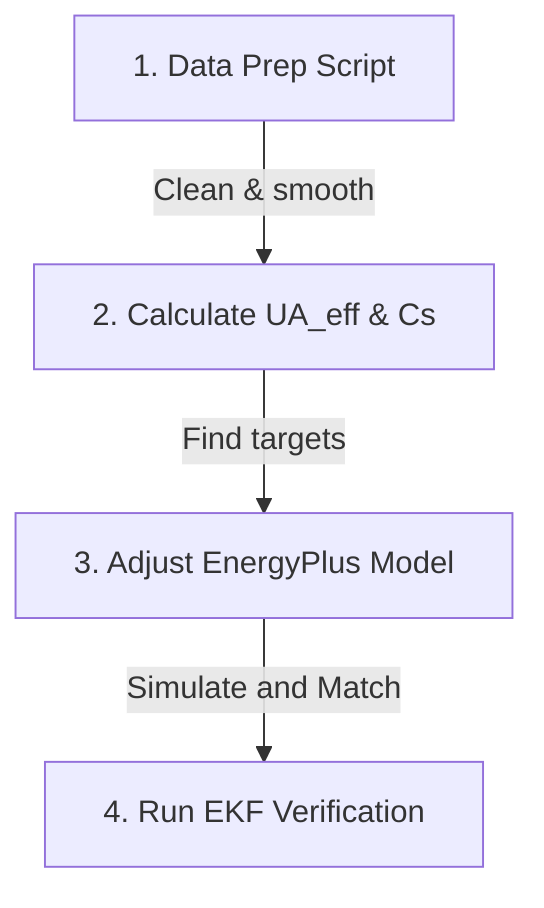

# Cold-Room Idle Test — Initial Data Analysis
**File:** `Idel_test_2026_07_21.csv`  
**Script:** [explore_sensor_data.py](file:///d:/UNI/Sem%207/ME420%20Mech%20Eng%20Research%20Project/SmartBEM-Studio/Readings_from_rig/explore_sensor_data.py)

---

## Dataset Overview

| Property | Value |
|:---|:---|
| **Total rows** | 2,018 |
| **Duration** | 170.1 min (≈ 2.83 hours) |
| **Sample interval** | ~5 seconds |
| **Total columns** | 62 |
| **Chamber sensors** | Sensor 1 (`room_1_*`), Sensor 2 (`room_2_*`), Sensor 3 (`room_3_*`) — all 3 are inside the same 2×2×2m cold room chamber |
| **Other sensor nodes** | `outside_*`, `supply_*`, `return_*`, `mixed_*`, `cooler_*`, `heated_*` |
| **Control / state signals** | `mixer`, `fan`, `flowrate`, `coolerState`, `heaterState`, `humidifierState` |

> [!NOTE]
> `room_1`, `room_2`, `room_3` in the CSV column names **do not represent separate rooms**. They are three individual temperature/humidity sensors mounted at different positions inside the single 2×2×2m PU foam chamber. One is a Bosch sensor (most accurate), the other two are of the same type.

---

## Temperature Statistics (°C)

| Sensor | Mean | Min | Max | Std | Notes |
|:---|:---:|:---:|:---:|:---:|:---|
| **Outside** | 32.63 | 32.01 | 32.96 | 0.16 | Very stable |
| **Chamber Sensor 1** | 21.84 | 19.47 | 28.03 | 2.64 | Bosch — appears most accurate |
| **Chamber Sensor 2** | 24.30 | 20.82 | 32.08 | 3.03 | Same type — readings look reasonable |
| **Chamber Sensor 3** | 23.91 | −14.46 | 98.52 | 9.80 | Same type — spikes present, but outlier removal should recover it |
| **Supply** | 18.77 | 16.94 | 32.05 | 3.27 | Cold air from evaporator |
| **Return** | 21.37 | 19.02 | 31.90 | 3.06 | Warm air back to unit |

> [!NOTE]
> Chamber Sensor 3 shows sudden spikes (values like −14°C and +98°C) which are outlier read errors — **not a faulty sensor**. The underlying valid readings look consistent with Sensors 1 and 2. These spikes can be removed with a simple outlier filter (e.g. IQR clipping or rolling median). We will clean this in the next analysis step.

---

## Key Observations from Plots

### 1. AC pulled the chamber down successfully
Chamber Sensor 1 (Bosch) dropped from **~28°C → ~19–20°C** over the first ~25 minutes, then held relatively steady around **17–21°C** for the remaining 2+ hours. This confirms the AC is working and the PU foam chamber has reasonable insulation.

### 2. The system never fully reached thermal equilibrium in 3 hours
The Supply temperature was still slowly drifting downward at the end of the test (from ~19°C toward ~17°C). The chamber had not reached a true **steady-state**. This is expected — you'll need the full **8-hour test** to see the flat steady-state region, which is what we need for calibration.

### 3. Supply vs Return temperature gap is meaningful
- **Supply** ≈ 17–19°C (cold air out of evaporator)
- **Return** ≈ 19–23°C (warm air back to unit)

The **gap (Return − Supply) ≈ 2–4°C** tells us the heat being extracted by the AC. Combined with the flow rate, this can back-calculate the **actual cooling load in Watts** — useful for validating the model.

### 4. Outside temperature remarkably stable
Outside varied only 32.01–32.96°C over 3 hours (σ = 0.16°C). This is ideal — a very stable outdoor boundary condition makes calibration data much cleaner.

---

## Full Column Reference

All 62 columns from the CSV, grouped by sensor node. Some channels were still under development or had relay issues during this run — those are marked accordingly.

### Per-sensor suffix pattern
Each sensor node (`outside`, `room_1`, `room_2`, `room_3`, `supply`, `return`, `mixed`, `cooler`, `heated`) repeats the same 6 suffixes:

| Suffix | Understood as | Confidence |
|:---|:---|:---:|
| `_t` | Temperature (°C) | ✅ Confirmed |
| `_h` | Relative Humidity (%) | ✅ Confirmed |
| `_c` | CO₂ concentration (ppm) — values in 400–600 range consistent with ambient CO₂ | 🔶 Likely |
| `_p` | Barometric Pressure (hPa) — taken as extra; not needed for our calibration tasks | ❌ Not used |

### Control / state signals

| Column | Understood as | Status in this run |
|:---|:---|:---|
| `mixer` | Fresh air intake opening % — servo-controlled sliding door (10×10 cm) on the AHU that lets outdoor air in; value is the opening percentage | ✅ Confirmed |
| `fan` | Fan speed as a percentage — a physical mapping to actual airflow (m/s) was done using a digital anemometer. Calibration data in [fan_value_and_anemometer.csv](file:///d:/UNI/Sem%207/ME420%20Mech%20Eng%20Research%20Project/SmartBEM-Studio/Readings_from_rig/fan_value_and_anemometer.csv). Key points: fan is effectively off below 35%; flow saturates at ~9.2 m/s (mixer OFF) or ~10 m/s (mixer ON) above ~85%. | ✅ Confirmed + Calibrated |

> [!NOTE]
> Several columns read 0 throughout because some channels were still being developed and some relays were burned during this initial run. This table will be filled in fully once Janith confirms each column's mapping.

---

## AHU Fixed Supply Settings for the Calibration Run

The AHU supply temperature and humidity can be set manually as a fixed value before the run but cannot be changed in real-time during the experiment. Here is what to set and why.

### Supply Temperature

**Note: AHU temperature control was not operational — the setup was broken and this was neglected during the Full Day 1 recordings.** The supply temperature was not actively set; it reflects whatever the compressor naturally delivered (~17°C). This recommendation remains valid for future sessions once the AHU is repaired.

### Supply Humidity

**Note: AHU humidity control was not operational — the setup was broken and this was neglected during the Full Day 1 recordings.** Supply humidity was uncontrolled. This recommendation remains valid for future sessions once the AHU is repaired.

> [!IMPORTANT]
> Record the exact supply temperature and humidity values you set before starting the 8-hour run. These become **fixed boundary conditions** you enter into the EnergyPlus model — the simulation will use them as the AHU supply input.

| Sensor | Mean | Min | Max |
|:---|:---:|:---:|:---:|
| **Outside** | 60.1% | 57.4% | 64.0% |
| **Chamber Sensor 1** | 60.8% | 50.1% | 80.7% |
| **Chamber Sensor 2** | 60.0% | 50.3% | 87.8% |
| **Chamber Sensor 3** | 74.4% | 30.5% | 100% |
| **Supply** | 76.5% | 52.5% | 90.1% |
| **Return** | 67.6% | 59.5% | 79.5% |

Chamber Sensor 1 humidity rose during AC operation (air cools → relative humidity climbs). This is physically correct and expected. Sensor 3 humidity stats are distorted by the same spikes as the temperature channel.

---

## Action Items Before 8-Hour Run

- [ ] **Clean Sensor 3 spikes** — apply outlier removal in the plotting script (IQR or rolling median); underlying data should then be usable
- [ ] **Confirm which physical sensor is which** — identify which of the three (`room_1`, `room_2`, `room_3`) is the Bosch sensor so we label it correctly going forward
- [ ] **Verify `coolerState` logging** — confirm ON/OFF transitions are being captured in the next run
- [ ] **Log the AC setpoint** if possible — knowing the thermostat target helps interpret when the AC is in active cooling vs. idle
- [ ] **Measure instrument power** — total W draw of DAQ + sensors inside the chamber (needed as fixed equipment load in model)
- [ ] **Target 8+ hours** — need to see the flat steady-state region (expected after hour 3–4)

---

## Plots Generated

All plots are in: `Readings_from_rig/plots/`

| File | What it shows |
|:---|:---|
| [01_all_temperatures.png](file:///d:/UNI/Sem%207/ME420%20Mech%20Eng%20Research%20Project/SmartBEM-Studio/Readings_from_rig/plots/01_all_temperatures.png) | All temperature channels on one chart |
| [02_interior_vs_outdoor_temp.png](file:///d:/UNI/Sem%207/ME420%20Mech%20Eng%20Research%20Project/SmartBEM-Studio/Readings_from_rig/plots/02_interior_vs_outdoor_temp.png) | All 3 chamber sensors vs outdoor (key calibration chart) |
| [03_hvac_stream_temps.png](file:///d:/UNI/Sem%207/ME420%20Mech%20Eng%20Research%20Project/SmartBEM-Studio/Readings_from_rig/plots/03_hvac_stream_temps.png) | Supply / Return temperatures (cooling load indicator) |
| [04_all_humidity.png](file:///d:/UNI/Sem%207/ME420%20Mech%20Eng%20Research%20Project/SmartBEM-Studio/Readings_from_rig/plots/04_all_humidity.png) | All humidity channels |
| [05_room1_vs_cooler_state.png](file:///d:/UNI/Sem%207/ME420%20Mech%20Eng%20Research%20Project/SmartBEM-Studio/Readings_from_rig/plots/05_room1_vs_cooler_state.png) | Chamber Sensor 1 (Bosch) temp overlaid with cooler state |
| [06_flowrate.png](file:///d:/UNI/Sem%207/ME420%20Mech%20Eng%20Research%20Project/SmartBEM-Studio/Readings_from_rig/plots/06_flowrate.png) | Air flow rate over time |

---

---

# Full Day 1 — Multi-Part Dataset Analysis
**Date:** 2026-07-23  
**Scripts:** [quick_stats.py](file:///d:/UNI/Sem%207/ME420%20Mech%20Eng%20Research%20Project/SmartBEM-Studio/Readings_from_rig/quick_stats.py) · [plot_full_day1.py](file:///d:/UNI/Sem%207/ME420%20Mech%20Eng%20Research%20Project/SmartBEM-Studio/Readings_from_rig/plot_full_day1.py)

> [!NOTE]
> Recording had to be stopped and restarted multiple times due to ESP sensor disconnections and the chamber being opened to fix internal wiring. Parts 3 and 4 are missing from the provided files. Sudden spikes and drifts visible in some parts are expected and are caused by these interruptions — they do not indicate bad sensors.

---

## Dataset Summary

| Part | Duration | Rows | Start (UTC) | End (UTC) | Notes |
|:---|:---:|:---:|:---|:---|:---|
| **Part 1** | 72.6 min | 872 | 03:16 UTC (~08:45 SL) | 04:29 UTC (~09:59 SL) | Morning ~9–10 am local; pulldown phase, Sensor 3 spikes |
| **Part 2** | 39.3 min | 473 | 04:36 UTC (~10:06 SL) | 05:15 UTC (~10:45 SL) | Morning ~10–11 am local; settled phase, Outside sensor dropout at end |
| *(Part 3)* | — | — | — | — | Removed — data quality too poor |
| *(Part 4)* | — | — | — | — | Removed — data quality too poor |
| **Part 5** | 71.7 min | 861 | 06:39 UTC (~12:09 SL) | 07:50 UTC (~13:20 SL) | Afternoon ~1–2 pm local; re-pulldown after gap, Sensor 3 one spike |
| **Part 6** | 83.2 min | 1,000 | 08:20 UTC (~13:50 SL) | 09:43 UTC (~15:13 SL) | Afternoon ~2–4 pm local; most stable, Sensor 3 fully disconnected (= 0) |
| **Total recorded** | ~267 min (~4.5 hrs) | 3,206 | — | — | ~130 min gap from missing parts 3 & 4 |

---

## Temperature Statistics by Part (°C) — after outlier clip

### Part 1
| Sensor | Mean | Min | Max | Std |
|:---|:---:|:---:|:---:|:---:|
| Outside | 30.24 | 28.93 | 30.74 | 0.47 |
| Sensor 1 (Bosch) | 22.58 | 20.06 | 24.96 | 1.48 |
| Sensor 2 | 25.69 | 22.97 | 28.74 | 1.76 |
| Sensor 3 | 24.19 | — | — | 10.37* |
| Supply | 18.51 | 16.07 | 33.42 | 3.47 |
| Return | 21.86 | 19.26 | 25.70 | 1.71 |

### Part 2
| Sensor | Mean | Min | Max | Std |
|:---|:---:|:---:|:---:|:---:|
| Outside | 27.52 | 0.00* | 31.54 | 9.89 |
| Sensor 1 (Bosch) | 20.48 | 19.81 | 20.97 | 0.31 |
| Sensor 2 | 23.02 | 20.81 | 24.70 | 1.28 |
| Sensor 3 | — | — | — | high* |
| Supply | 19.79 | 16.58 | 25.14 | 3.45 |
| Return | 21.80 | 19.81 | 25.04 | 1.94 |

### Part 5
| Sensor | Mean | Min | Max | Std |
|:---|:---:|:---:|:---:|:---:|
| Outside | 32.92 | 32.40 | 33.50 | 0.24 |
| Sensor 1 (Bosch) | 23.26 | 21.10 | 27.00 | 1.82 |
| Sensor 2 | 26.57 | 24.30 | 30.10 | 1.89 |
| Sensor 3 | 22.33 | — | — | 6.80* |
| Supply | 18.05 | 16.90 | 30.50 | 2.31 |
| Return | 22.41 | 20.40 | 30.10 | 2.02 |

### Part 6
| Sensor | Mean | Min | Max | Std |
|:---|:---:|:---:|:---:|:---:|
| Outside | 33.84 | 33.20 | 34.30 | 0.17 |
| Sensor 1 (Bosch) | 22.06 | 20.80 | 23.60 | 0.86 |
| Sensor 2 | 25.49 | 24.30 | 27.20 | 0.83 |
| Sensor 3 | 0.00 | — | — | — (disconnected) |
| Supply | 17.42 | 16.60 | 26.30 | 1.41 |
| Return | 21.91 | 20.50 | 86.70 | 5.06* |

*\* High std due to spikes / dropout — usable data exists underneath after outlier removal.*

---

## Per-Part Observations

### Part 1 — Active Pulldown, Sensor 3 Spiking
**Time:** 03:16–04:29 UTC (72 min) · **Plot:** [full_day1_part_1_temp_hum.png](file:///d:/UNI/Sem%207/ME420%20Mech%20Eng%20Research%20Project/SmartBEM-Studio/Readings_from_rig/plots/full_day1/full_day1_part_1_temp_hum.png)

- Sensor 1 (Bosch) dropped from **~25°C → ~20°C** over ~70 minutes — a clear, smooth pulldown curve suitable for calibration.
- Sensor 2 dropped from **~29°C → ~23°C**, tracking about 3°C above Sensor 1 throughout — consistent offset likely due to sensor position (possibly further from supply vent).
- Sensor 3 shows **regular spike dropouts** (same pattern as the idle test) — outlier removal will recover the underlying signal.
- Humidity in both sensors dropped from ~70–75% down to ~48–50% as the chamber cooled — physically correct.
- Supply temperature settled from ~25°C down to ~17°C, confirming the compressor was actively working throughout.
- **Outside temperature was lower than usual (~30°C)** — likely an early morning reading.

### Part 2 — Settled / Quasi-Steady State
**Time:** 04:36–05:15 UTC (39 min) · **Plot:** [full_day1_part_2_temp_hum.png](file:///d:/UNI/Sem%207/ME420%20Mech%20Eng%20Research%20Project/SmartBEM-Studio/Readings_from_rig/plots/full_day1/full_day1_part_2_temp_hum.png)

- This is the most useful part for calibration. **Sensor 1 (Bosch) was almost flat at ~20°C** (std = 0.31°C) — the closest thing to steady-state seen in the dataset.
- Sensor 2 hovered around 21–24°C, slightly noisier but still well-behaved.
- **Outside sensor completely dropped out at t ≈ 35 min** (read 0°C), which is a clear ESP disconnection event — not a real temperature drop.
- Sensor 3 still spiking.
- Humidity was stable (~60–65%) — consistent with a settled cold room.
- **The 6-minute gap** between Part 1 and Part 2 (04:29–04:36) likely corresponds to the chamber being opened to fix the ESP connection.

### Part 5 — Re-Pulldown After Long Gap
**Time:** 06:39–07:50 UTC (72 min) · **Plot:** [full_day1_part_5_temp_hum.png](file:///d:/UNI/Sem%207/ME420%20Mech%20Eng%20Research%20Project/SmartBEM-Studio/Readings_from_rig/plots/full_day1/full_day1_part_5_temp_hum.png)

- There is a **~84-minute gap** after Part 2 (missing Parts 3 and 4). The chamber had clearly warmed back up during this gap — Sensor 1 starts at ~27°C and Sensor 2 at ~29°C, meaning someone opened the chamber or the AC was off.
- Both sensors show a **fresh pulldown curve** starting from ~27–29°C toward ~21°C over 70 minutes.
- Sensor 3 shows one large spike at t ≈ 40 min (ESP reconnect event) then returns to a valid reading.
- Humidity again drops from ~77–79% down to ~51–54% tracking the temperature drop.
- Outside temperature stabilised at **32.9°C** — now in daytime range, more representative of calibration conditions.
- Supply temperature is stable at ~17°C throughout (slight spike at t ≈ 40 min matching Sensor 3 spike).

### Part 6 — Most Stable, Sensor 3 Fully Offline
**Time:** 08:20–09:43 UTC (83 min) · **Plot:** [full_day1_part_6_temp_hum.png](file:///d:/UNI/Sem%207/ME420%20Mech%20Eng%20Research%20Project/SmartBEM-Studio/Readings_from_rig/plots/full_day1/full_day1_part_6_temp_hum.png)

- **Best quality part overall.** Sensor 1 (Bosch) is clean and smooth (std = 0.86°C), pulling down from ~24°C to ~21°C then levelling off.
- Sensor 2 similarly clean (std = 0.83°C), settling at ~24–25°C.
- **Sensor 3 reads exactly 0.0 for the entire part** — the ESP was fully disconnected. Effectively a two-sensor run. Can be treated as missing data.
- Supply is very stable at ~16.7–17°C — the most consistent supply temperature of all parts.
- **Return spiked to 86°C** at one point (single outlier, clear sensor glitch, removable).
- Outside stable at 33.8°C — consistent daytime ambient.
- After ~60 min, temperatures appear to be reaching near-steady state — **Sensor 1 ≈ 21°C, Sensor 2 ≈ 24°C, Supply ≈ 17°C**.

---

## Cross-Part Observations

| Observation | Detail |
|:---|:---|
| **Sensor 1 (Bosch) is consistently the most reliable** | Smooth, low-noise, smallest std in every part |
| **Sensor 2 runs ~3°C warmer than Sensor 1** | Consistent offset across all parts — likely a position effect (different wall, further from supply) |
| **Sensor 3 is unreliable** | Spikes in Parts 1, 2, 5; fully offline in Part 6. Outlier removal recovers some data from Parts 1 and 5 |
| **Supply temperature is consistent across parts** | ~17°C in all parts — AHU was likely set at a fixed point as intended |
| **Outside temperature rose over the day** | 30°C (early morning, Part 1) → 33.8°C (mid-morning, Part 6) — confirms daytime heating |
| **Chamber never fully reached steady-state in any single part** | Longest uninterrupted stretch ≈ 83 min (Part 6); not quite flat at the end but close |

---

## Usability Assessment for Calibration

| Part | Temperature data quality | Usable for calibration? |
|:---|:---|:---:|
| Part 1 | Good — clean pulldown on Sensors 1 & 2 | ✅ Yes (after Sensor 3 outlier removal) |
| Part 2 | Best — near-steady-state on Sensor 1 | ✅ Yes — most valuable segment |
| Part 5 | Good — re-pulldown, one spike | ✅ Yes (after spike removal) |
| Part 6 | Best thermal quality — only 2 sensors | ✅ Yes — best single continuous segment |

> [!IMPORTANT]
> **Part 6 + Part 2** together are the most valuable for calibration. Part 6 gives the cleanest pulldown and longest near-steady-state. Part 2 gives the flattest Sensor 1 reading. Once the chamber is re-tested with a fixed 8-hour uninterrupted run and Sensor 3 repaired/reconnected, these will serve as the training dataset.

---

## Plots Generated (Full Day 1)

All in: `Readings_from_rig/plots/full_day1/`

| File | What it shows |
|:---|:---|
| [full_day1_combined_timeline.png](file:///d:/UNI/Sem%207/ME420%20Mech%20Eng%20Research%20Project/SmartBEM-Studio/Readings_from_rig/plots/full_day1/full_day1_combined_timeline.png) | All 4 parts on shared wall-clock axis with gap shading |
| [full_day1_part_1_temp_hum.png](file:///d:/UNI/Sem%207/ME420%20Mech%20Eng%20Research%20Project/SmartBEM-Studio/Readings_from_rig/plots/full_day1/full_day1_part_1_temp_hum.png) | Part 1 temperature + humidity |
| [full_day1_part_2_temp_hum.png](file:///d:/UNI/Sem%207/ME420%20Mech%20Eng%20Research%20Project/SmartBEM-Studio/Readings_from_rig/plots/full_day1/full_day1_part_2_temp_hum.png) | Part 2 temperature + humidity |
| [full_day1_part_5_temp_hum.png](file:///d:/UNI/Sem%207/ME420%20Mech%20Eng%20Research%20Project/SmartBEM-Studio/Readings_from_rig/plots/full_day1/full_day1_part_5_temp_hum.png) | Part 5 temperature + humidity |
| [full_day1_part_6_temp_hum.png](file:///d:/UNI/Sem%207/ME420%20Mech%20Eng%20Research%20Project/SmartBEM-Studio/Readings_from_rig/plots/full_day1/full_day1_part_6_temp_hum.png) | Part 6 temperature + humidity |

---

# Next Steps — Using Fragmented Data for Chamber Calibration

> [!NOTE]
> A single clean 8-hour run is ideal but not always possible. The 4 parts we have are still scientifically usable. Fragmented data with multiple pull-down curves is actually a **richer dataset** than a single long flat run, because it gives us both the dynamic response (Cs) and the near-steady-state behaviour (UA) from multiple independent experiments.

---

## Step 1 — Data Cleaning Pipeline (before anything else)

For each part, apply the following in order:

| Step | What to do | Why |
|:---|:---|:---|
| **1a. Clip overflow spikes** | Remove any reading where the temperature is above 60°C or below −30°C | In this setup, no real temperature will ever be that extreme — these are only caused by sensor disconnections and ADC glitches. 60°C is chosen as a safe ceiling well above any real measurement (outdoor is ~34°C at most, chamber is ~20°C) |
| **1b. IQR outlier filter** | For each sensor, look at any 2-minute window of readings; flag and remove points that jump more than 3× the typical spread away from the middle value | The 2-minute window is a starting suggestion — wide enough to capture the normal slow thermal drift but short enough that a sudden spike stands out clearly. Adjust if needed after seeing how it performs on the data |
| **1c. Apply EMA smoothing** | Apply Exponential Moving Average with a span of ~30 seconds (6 readings at 5 s intervals) to all cleaned temperature channels | Reduces sensor noise without distorting the thermal trend |
| **1d. Mark gap boundaries** | Insert `NaN` rows at the start/end of each part to prevent the plot/model from connecting across gaps | Prevents false continuity between parts |

**Which sensor to use as primary:** Sensor 1 (Bosch) — it is the cleanest in every part. Sensor 2 can be used as a secondary cross-check. Sensor 3 only after full outlier removal from Parts 1 and 5.

---

## Step 2 — Identify Which Segments Are Usable

After cleaning, extract the following segments for calibration:

| Segment | Part | Approx time window | What it gives |
|:---|:---|:---|:---|
| **Pulldown A** | Part 1 | t = 0 → 70 min | Dynamic cooling curve → useful for Cs (thermal mass) |
| **Quasi-steady A** | Part 2 | t = 0 → 35 min | Near-flat Sensor 1 at ~20°C → useful for UA |
| **Pulldown B** | Part 5 | t = 0 → 70 min | Second independent dynamic curve → cross-validates Cs |
| **Quasi-steady B** | Part 6 | t = 50 → 83 min | Closest to steady-state → best estimate of UA |

Having **two pulldown curves** (Parts 1 and 5) and **two near-steady segments** (Parts 2 and 6) is a strong basis for calibration — it is not just one experiment.

---

## Step 3 — Find the chamber's heat leakage (UA_effective)

**What this step is about:** The chamber has PU foam walls, a door with a gasket, and small air gaps. All of these let heat leak in from outside. We want a single number — $UA + c_{pa} \dot{m}_{inf}$ in W/K (called $UA_{\text{effective}}$) — that tells us the *total* rate of heat leaking into the chamber per degree of temperature difference.

> [!NOTE]
> **Connection to the 6 calibration parameters in [cool_room_modeling_strategy.md](file:///d:/UNI/Sem%207/ME420%20Mech%20Eng%20Research%20Project/SmartBEM-Studio/Readings_from_rig/cool_room_modeling_strategy.md) Section 11:**
> Those 6 parameters (foam conductivity `k`, chamber infiltration ACH, hanger infiltration, equipment gains, ground coupling, SHGC) are all *knobs you turn inside the model*. $UA_{\text{effective}}$ and $C_s$ are the *targets you are trying to hit* with those knobs. Steps 3 and 4 use the real sensor data to find out what those targets actually are.

---

### Where the formula comes from — the advisor's equation

The formula comes directly from **your advisor's Section 1.1 equation** in [EKF_System_Reference.md](file:///d:/UNI/Sem%207/ME420%20Mech%20Eng%20Research%20Project/SmartBEM-Studio/EKF/EKF_System_Reference.md), which is the full sensible energy balance on the zone:

$$C_s \dot{T}_z = -UA\,T_z - c_{pa}(m_{inf}+m_{sa})T_z + UA\,T_o + c_{pa}\,m_{inf}\,T_o + c_{pa}\,m_{sa}\,T_{sa} + Q_{bg}$$

*(No occupants in our setup, so the $f_c q^{occ}_{sens} N$ term = 0.)*

**At steady state the chamber temperature is not changing, so $\dot{T}_z = 0$.** Setting the left side to zero:

$$0 = (UA + c_{pa}\,m_{inf})(T_o - T_z) + c_{pa}\,m_{sa}(T_{sa} - T_z) + Q_{bg}$$

The term $c_{pa}\,m_{sa}(T_z - T_{sa})$ is the **AC cooling power** $Q_{AC}$ (heat the supply air removes from the zone). Substituting:

$$\boxed{Q_{AC} = (UA + c_{pa}\,m_{inf})(T_o - T_z) + Q_{bg}}$$

Rearranging to solve for the combined wall+infiltration conductance:

$$\boxed{UA + c_{pa}\,m_{inf} = \frac{Q_{AC} - Q_{bg}}{T_o - T_z}}$$

This is the formula we will calculate. The advisor's compact EKF form calls this $\alpha_o \cdot C_s$ (Section 1.2). In our calibration step we call it $UA_{\text{effective}}$.

---

### Variable definitions (using advisor's exact notation)

| Symbol | Advisor notation | Source in our CSV / setup |
|:---|:---|:---|
| $T_z$ | Zone temperature | Weighted average of `room_1_t`, `room_2_t`, `room_3_t` (see below) |
| $T_o$ | Outdoor temperature | `outside_t` column |
| $T_{sa}$ | Supply air temperature | `supply_t` column |
| $Q_{AC}$ | AC cooling power (W) | $c_{pa} \cdot m_{sa} \cdot (T_z - T_{sa})$ — computed from return/supply and fan |
| $Q_{bg}$ | Background equipment heat (W) | Only an **ESP32** is inside → draws ~1 W. **Effectively negligible; use $Q_{bg} \approx 1$ W** |
| $m_{inf}$ | Infiltration mass flow rate (kg/s) | Unknown — absorbed into $UA_{\text{effective}}$ |
| $m_{sa}$ | Supply air mass flow rate (kg/s) | Derived from `fan` % via anemometer calibration table |
| $c_{pa}$ | Specific heat of air | 1006 J/(kg·K) — a fixed constant |

---

### Computing $T_z$ — using all 3 sensors

Since the chamber is small (2m × 2m × 2m), all 3 sensors should ideally measure the same temperature. In practice they differ slightly due to sensor position. A weighted average is more accurate than using only Sensor 1:

$$T_z = w_1 \cdot T_{\text{S1}} + w_2 \cdot T_{\text{S2}} + w_3 \cdot T_{\text{S3}}$$

Recommended weights (based on sensor reliability seen in data):
| Sensor | Column | Weight | Reason |
|:---|:---|:---:|:---|
| Sensor 1 (Bosch) | `room_1_t` | **0.6** | Most accurate, lowest noise |
| Sensor 2 | `room_2_t` | **0.4** | OK sensor, slight noise |
| Sensor 3 | `room_3_t` | **0 (or 0.2 after cleaning)** | Only use after spike removal; set to 0 if offline (Part 6) |

If Sensor 3 is excluded: use $w_1 = 0.6$, $w_2 = 0.4$, $w_3 = 0$. The weights should sum to 1.

---

### How to calculate $Q_{AC}$

$$Q_{AC} = m_{sa} \times 1006 \times (T_z - T_{sa})$$

where $m_{sa}$ (kg/s) is found from the fan calibration:
1. Read `fan` % from the CSV.
2. Look up velocity $v$ in [fan_value_and_anemometer.csv](file:///d:/UNI/Sem%207/ME420%20Mech%20Eng%20Research%20Project/SmartBEM-Studio/Readings_from_rig/fan_value_and_anemometer.csv).
3. $m_{sa} = 1.2 \times v \times A_{\text{duct}}$ (e.g. 15 cm duct → $A = 0.0177\text{ m}^2$).

---

### Calculation procedure (using Part 6 tail as example)

| Step | What to do | Example value |
|:---|:---|:---:|
| 1 | Compute weighted $T_z$ from Sensors 1 & 2 over last 30 min of Part 6 | ~21.3°C |
| 2 | Average `outside_t` ($T_o$) over same window | ~33.8°C |
| 3 | Average `supply_t` ($T_{sa}$) over same window | ~17.4°C |
| 4 | Convert `fan` % to $m_{sa}$ using anemometer table | ~0.085 kg/s |
| 5 | $Q_{AC} = 0.085 \times 1006 \times (21.3 - 17.4)$ | **~333 W** |
| 6 | $Q_{bg} \approx 1$ W (ESP32 only) | 1 W |
| 7 | $UA_{\text{eff}} = (333 - 1) / (33.8 - 21.3)$ | **~26.6 W/K** |

Repeat for Part 2 quasi-steady segment. If both values are within ~20% of each other, the result is reliable.

---

## Step 4 — Find the chamber's thermal mass (Cs)

**What this step is about:** Thermal mass ($C_s$) tells you how much energy the chamber walls and air can absorb — a larger $C_s$ means the chamber cools slowly; a smaller one means it cools quickly. The pulldown curve contains this information.

---

### Where the formula comes from — the same advisor's equation

This also comes directly from **Section 1.1** of [EKF_System_Reference.md](file:///d:/UNI/Sem%207/ME420%20Mech%20Eng%20Research%20Project/SmartBEM-Studio/EKF/EKF_System_Reference.md), but now **during pulldown**, where $\dot{T}_z \neq 0$:

$$C_s \dot{T}_z = (UA + c_{pa}\,m_{inf})(T_o - T_z) + c_{pa}\,m_{sa}(T_{sa} - T_z) + Q_{bg}$$

Substituting $Q_{AC} = c_{pa}\,m_{sa}(T_z - T_{sa})$ and $UA_{\text{effective}} = UA + c_{pa}\,m_{inf}$:

$$\boxed{C_s \cdot \dot{T}_z = UA_{\text{effective}} \cdot (T_o - T_z) + Q_{bg} - Q_{AC}}$$

In plain terms: *thermal mass × rate of temperature change = net heat going into the chamber per second*.

Rearranging to solve for $C_s$ by integrating over the entire pulldown window:

$$C_s = \frac{\text{Total net energy added to chamber during pulldown}}{T_{z,\text{end}} - T_{z,\text{start}}}$$

Once $UA_{\text{effective}}$ is known from Step 3, $C_s$ is the only remaining unknown in this equation.

---

### Calculation procedure (using Part 1 pulldown as example)

| Step | What to do | Example value |
|:---|:---|:---:|
| 1 | Find start of pulldown in the CSV | $T_{z,\text{start}}$ ≈ 24.5°C |
| 2 | Find end of pulldown (temperature flattened) | $T_{z,\text{end}}$ ≈ 20°C |
| 3 | For every 5-second row: $Q_{\text{net}} = UA_{\text{eff}} \times (T_o - T_z) + Q_{bg} - Q_{AC}$ | e.g. −245 W per row |
| 4 | Multiply by $\Delta t = 5$ s → energy in Joules for that step | e.g. −1225 J |
| 5 | Sum all Joule steps over the pulldown window | e.g. −1,100,000 J |
| 6 | $C_s = -1{,}100{,}000 / (20 - 24.5)$ | **≈ 244,000 J/K** |

Repeat for Part 5 pulldown. If both agree within ~20%, $C_s$ is reliable.

---

## Step 5 — Enter Values into EnergyPlus Model

Once UA and Cs are back-calculated from the sensor data:

| Parameter | How to set in model | What to adjust |
|:---|:---|:---|
| **UA (wall conductance)** | Change PU foam thermal conductivity `k` (or effective thickness) | Increase `k` if model UA is too low; decrease if too high |
| **Cs (thermal mass)** | Adjust PU foam density and specific heat | Increase `density × Cp × volume` to raise Cs |
| **Infiltration** | Set ACH in the chamber's `ZoneInfiltration` object | Tune if steady-state temperatures don't converge even after UA/Cs match |

> [!IMPORTANT]
> When adjusting `k` in the model, you are capturing the **effective** conductance — not just the foam conductivity, but also the joint gaps, metal clips, and door seals. It is normal for the calibrated `k` to be higher than the manufacturer spec.

---

## Step 6 — Verify EKF Convergence

Once the EnergyPlus model is calibrated to the sensor data:
1. Run the EKF on the cleaned Sensor 1 time-series from the real data
2. Check that the EKF's estimated UA and Cs converge to the values found in Steps 3 and 4
3. If the EKF converges within ±20% of your manually calibrated values → the EKF is validated

---

## Summary Checklist

- [ ] **Clean all 4 parts** — clip spikes, IQR filter, apply EMA to Sensor 1 and Sensor 2
- [ ] **Identify usable segments** — two pulldowns (Parts 1 & 5) and two quasi-steady (Parts 2 & 6 tail)
- [ ] **Measure instrument power draw** inside the chamber (watt meter) — needed for Step 3
- [ ] **Calculate UA** from the two steady-state segments
- [ ] **Calculate Cs** from the two pulldown curves
- [ ] **Update EnergyPlus model** with calibrated UA and Cs values
- [ ] **Run EKF** on cleaned sensor data and verify convergence
- [ ] **Fix Sensor 3 ESP connection** before next recording session

---

## Execution Roadmap — Immediate Action Plan

To move forward with your ME420 Mech Eng Research Project using these specific Day 1 datasets, follow this exact workflow:

### Phase 1: Data Cleaning & Weighted Average (Python Script)
Write a Python script (using Pandas) to clean the 4 parts (`Part 1`, `Part 2`, `Part 5`, `Part 6`) and prepare them for calculation:
* **Spike Removal:** Filter out any values where temperature is above 60°C or below -30°C (clips the ADC glitches on Sensor 3 and Return Sensor).
* **Z-Score/IQR Filter:** Remove small rapid noise spikes on Sensor 3 and Sensor 2.
* **Weighted Zone Temperature ($T_z$):** Compute $T_z = 0.6 \cdot T_{\text{S1}} + 0.4 \cdot T_{\text{S2}}$ (setting Sensor 3 weight to 0 since it is spiking or offline).
* **EMA Smoothing:** Apply a 30-second Exponential Moving Average on the cleaned $T_z$, $T_o$, $T_{sa}$, $T_{\text{return}}$, and $m_{sa}$ to smooth out high-frequency noise.

### Phase 2: Compute UA and Cs Targets from Sensors
Using the cleaned data, run the calculations manually:
1. **Compute $UA_{\text{effective}}$:**
   * Take the last 20 minutes of Part 6 (quasi-steady state).
   * Calculate $Q_{sa} = m_{sa} \cdot 1006 \cdot (T_z - T_{sa})$.
   * Calculate $UA_{\text{effective}} = (Q_{sa} - 1.0\text{ W}) / (T_o - T_z)$.
   * Repeat for Part 2 and average the two values. This is your target $UA_{\text{effective}}$.
2. **Compute $C_s$:**
   * Take the pulldown portion of Part 1.
   * Compute the discrete timestep energy sum using your target $UA_{\text{effective}}$.
   * Solve for $C_s$ by dividing the total energy by $(T_{z,\text{end}} - T_{z,\text{start}})$.
   * Repeat for Part 5 and average the two values. This is your target $C_s$.

### Phase 3: EnergyPlus Model Tuning
1. Set up the nested geometry (Cool Room Chamber inside Hanger) in the SmartBEM-Studio web interface.
2. In the simulation, adjust the PU foam conductivity `k` and the chamber infiltration rate until the simulation's computed UA matches your sensor-derived $UA_{\text{effective}}$.
3. Adjust the PU foam density/specific heat capacity until the simulation's thermal mass matches your sensor-derived $C_s$.
4. Run the simulation and verify that the virtual room's temperature profile closely matches your cleaned sensor logs.

### Phase 4: EKF Validation
1. Feed the cleaned sensor time-series data into your EKF code.
2. Verify that the EKF's estimated state parameters ($\alpha_o$ and $\alpha_s$) converge to the physical values of $UA_{\text{effective}}$ and $C_s$ you calculated in Phase 2.
3. If they converge within ±20%, your research methodology is validated and ready for the final report!

