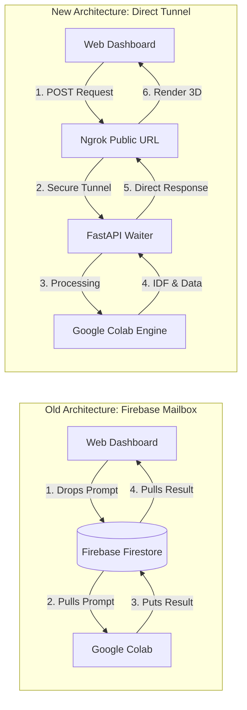

# Understanding Our New Architecture: FastAPI & Ngrok

Before we start writing code, it's very important that you understand *how* and *why* this new setup works. This document will explain FastAPI and Ngrok using simple analogies.

---

## 1. The Problem We Are Solving (Why we used Firebase)

Imagine Google Colab is a high-security vault. Inside this vault, we have our heavy machinery: the **LLM (Ollama)** and the **EnergyPlus Simulator**. 

Because it's a high-security vault, **nobody on the outside internet is allowed to send a message directly inside.** If your web dashboard (running on your laptop or hosted on Vercel) tries to send a prompt directly to Colab, Google's firewall blocks it instantly.

**How Firebase solved this:**
Firebase acted as a **mailbox sitting outside the vault**. 
1. Your web dashboard dropped a letter (the prompt) into the mailbox.
2. Colab constantly checked the mailbox every 5 seconds: *"Any new letters?"*
3. When Colab found a letter, it ran the simulation, and then dropped the result back into the mailbox for the web dashboard to pick up.

This worked, but managing the mailbox (Firebase accounts, databases, API keys) is annoying. We want to remove the mailbox entirely and just talk directly!

---

## 2. What is FastAPI? (The Waiter)

If we want to talk directly to Colab, Colab needs to know *how* to listen for messages and respond to them. 

**FastAPI** is an open-source Python library. When you run FastAPI inside Colab, it acts like a **Waiter at a restaurant**. 
Instead of Colab constantly checking a mailbox, the FastAPI waiter just stands there, holding a tray, ready to take an order. 

When your web dashboard says:
> *"Here is a POST request containing my prompt: 'Create a 5x5 office'."*

FastAPI takes the order, walks it back to the kitchen (Ollama and EnergyPlus), waits for the food (the IDF file) to be cooked, and then walks it back out and hands it directly to your web dashboard.

This is called a **REST API**. It is the industry standard way that almost all modern software communicates.

---

## 3. What is Ngrok? (The Magical Tunnel)

We have our FastAPI Waiter ready to take orders. But remember the problem? Colab is still inside a high-security vault! Your web dashboard can't reach the waiter.

This is where **Ngrok** comes in. 

Ngrok is a tool that creates a **secure, temporary tunnel through the firewall**. 
Imagine drilling a tiny, secure hole through the wall of the vault, attaching a pipe to it, and putting the other end of the pipe out on the public internet.

1. When we run Ngrok in Colab, it connects to the FastAPI Waiter on the inside.
2. Ngrok then generates a temporary public URL on the outside (e.g., `https://random-word.ngrok-free.app`). 
3. Anyone on the internet who visits that specific URL is instantly teleported through the pipe, straight to your FastAPI Waiter.

---

## 4. The New "Direct" Workflow

Here is exactly what happens when an evaluator or a student tests your project under the new architecture:

1. **Start the Engine:** The user opens your Google Colab notebook and clicks "Run All". 
2. **The Setup:** Colab installs the heavy machinery (EnergyPlus, Ollama). Then, it hires the Waiter (`FastAPI`) and opens the tunnel (`Ngrok`). 
3. **The URL:** Colab prints out a message: *"I am ready! My temporary tunnel URL is `https://xyz.ngrok-free.app`"*.
4. **The UI:** The user opens your web dashboard (`smarthvac.vercel.app` or `index.html` on their laptop). There is a new input box that says "Backend URL". They paste the Ngrok URL into it.
5. **The Magic:** The user types their prompt and clicks Simulate. The web dashboard fires the prompt directly through the Ngrok tunnel. The FastAPI waiter catches it, runs the simulation, and hands the 3D model right back through the tunnel.

**No Firebase. No databases. No API keys. Just a direct, encrypted conversation between your web dashboard and Colab!**

---

## 5. Architecture Diagram

