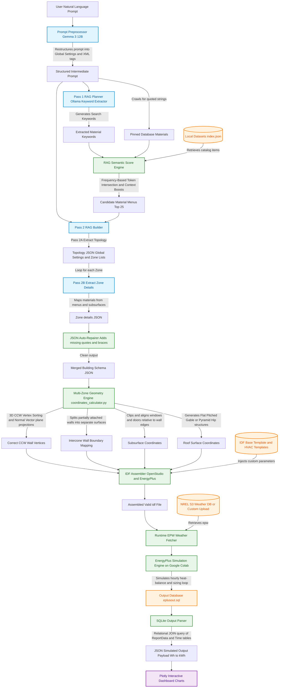

# Repository Structure

```
SmartBEM-Studio/
│
├── web/                          # Web Dashboard (Vanilla JS/HTML/CSS)
│   ├── index.html                # Home page (entry point)
│   ├── style.css                 # Component styles
│   ├── design_system.css         # CSS design tokens (colours, typography)
│   ├── script.js                 # Global JS (sidebar, backend connection)
│   ├── assets/                   # Icons, images
│   ├── data/
│   │   ├── weather_index.json    # Global EPW weather station database (~7000 stations)
│   │   └── index.json            # Material & construction dictionary index for UI search
│   └── pages/
│       ├── nlp.html              # Simulation Setup (main AI input page)
│       ├── results.html          # Results viewer (charts & plots)
│       ├── ekf.html              # EKF Estimation module (Plotly integration)
│       ├── architecture.html     # System architecture diagram
│       ├── diff_viewer.html      # Compare different generated IDF text outputs
│       ├── idf_viewer.html       # Visual IDF object inspector
│       └── about.html            # Project info & credits
│
├── backend_server/               # Backend (FastAPI server & orchestration pipeline)
│   ├── main_backend.ipynb        # Start here (main Colab backend server bootstrapper)
│   ├── requirements.txt          # Python dependencies
│   │
│   ├── core/                     # Core Python pipeline modules
│   │   ├── fastapi_server.py     # FastAPI app (HTTP endpoints & simulation/EKF routers)
│   │   ├── model_generator.py    # Ollama prompt orchestration (2-pass RAG)
│   │   ├── coordinates_calculator.py # Multi-zone coordinate & adjacency engine
│   │   ├── idf_assembler.py      # IDF file assembly from AI output
│   │   ├── chart_generator.py    # Plotly chart generation from simulation results
│   │   ├── weather_file_finder.py # EPW file download & caching from NREL S3
│   │   ├── material_dict_compiler.py # EnergyPlus dataset RAG indexer
│   │   ├── prompt_preprocessor.py # Prompt structuring preprocessor
│   │   └── index.json            # Pre-built dataset index for RAG
│   │
│   ├── idf_templates/            # EnergyPlus base templates
│   │   ├── Base.idf              # Base EnergyPlus template
│   │   ├── catalog.json          # HVAC system catalog
│   │   └── hvac/                 # Modular HVAC IDF snippets (psz_ac, split_ac, etc.)
│   │
│   └── eplus/                    # EnergyPlus Python bootstrap & parser tools
│       ├── eplus_util.py         # Full EnergyPlus utility library
│       ├── colab_bootstrap.py    # Colab environment setup helper (downloads EP release)
│       └── sql_explorer.py       # EnergyPlus SQLite result parser
│
├── EKF/                          # Extended Kalman Filter research module
│   ├── Real_EKF_ROBOD.py         # 10-state EKF estimation script (runs on Colab backend)
│   ├── EKF_System_Reference.md   # Mathematical reference & state-space derivation
│   ├── Datasets for EKF/         # ROBOD Room 3 sensor datasets for EKF analysis
│   └── Practise demos/           # Python worked examples and test cases
│
├── Datasets/                     # EnergyPlus IDD object libraries (RAG materials data)
├── EnergyPlus utility/           # Standalone Python wrappers for EnergyPlus executions
├── scripts/                      # Developer utilities (e.g. building weather index maps)
├── LLM_Prompt_Optimization_Guide.md # Prompt templates & optimization rules for building simulation
├── STRUCTURE.md                  # Annotated repository structure guide (this file)
├── user_description.md           # Production-grade 3-zone building specification example prompt
└── README.md                     # Main repository quickstart and setup instructions
```

## Runtime-only directories (gitignored, created automatically)

| Path | Created by | Contents |
|---|---|---|
| `backend_server/weather_cache/` | `weather_file_finder.py` | Downloaded EPW files (cached) |
| `backend_server/RunFiles/` | Simulation pipeline | Generated `.idf` files per job |
| `backend_server/sim_runs/` | EnergyPlus runner | Raw simulation output files |
| `backend_server/ollama_models/` | Ollama on Colab | Downloaded model weights |
| `backend_server/secrets.json` | You | Ngrok authtoken (never commit) |

---

## Detailed System Flowchart

Here is the complete end-to-end execution pipeline from raw prompt inputs to final dynamic charts:


