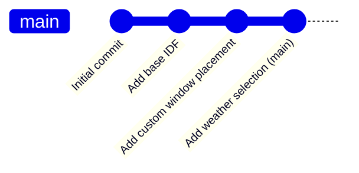
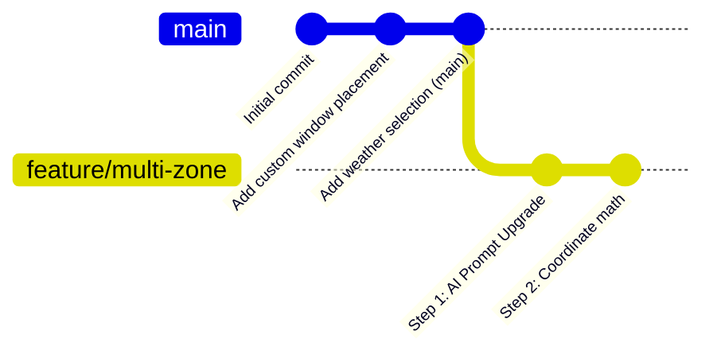
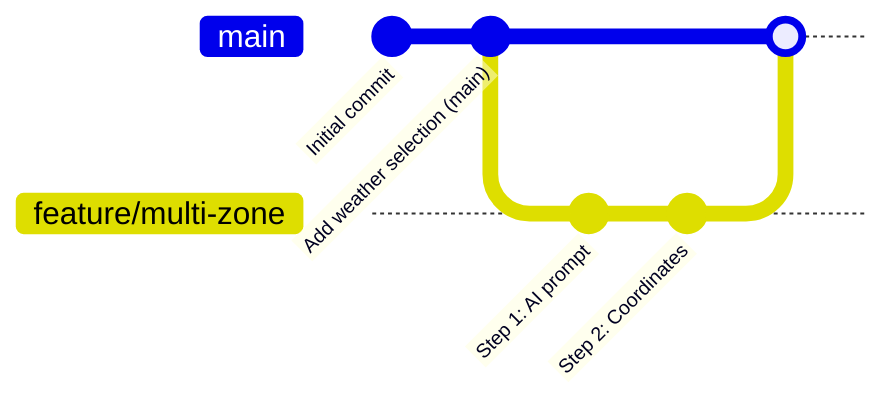

# Git Branching & Merging Guide for SmartHVAC-Studio

If you have only worked on the `main` branch before, Git branches can feel a bit mysterious. This guide explains how branches work using **SmartHVAC-Studio** as our direct example.

---

## 1. What is a Git Branch?

Think of a branch as a **parallel universe** or a **sandbox copy** of your entire project directory. 

Currently, you have a single branch: `main`. Every change you make is saved directly onto it. If you break something, the whole project is broken.



When you create a new branch called `feature/multi-zone`, Git creates a pointer from your last commit. Now you can work in this parallel universe without affecting `main`:



---

## 2. How it works on your Hard Drive

This is the most common point of confusion: **"Do I get a second folder on my computer?"**

**No!** You keep working in the exact same folder: `d:\UNI\Sem 7\ME420 Mech Eng Research Project\SmartHVAC-Studio`.

When you switch branches using Git, **Git physically swaps the files in that folder on your hard drive** in less than a second:
*   If you switch to `main`, files like `geometry_util.py` will have the old, single-zone code.
*   If you switch to `feature/multi-zone`, `geometry_util.py` will automatically update to include your new multi-zone code.

Your text editor (like VS Code or cursor) will instantly refresh to show the files matching whichever branch you have active.

---

## 3. How We Combine Them (Merging)

Once you are happy with the multi-zone features in `feature/multi-zone`, we need to merge them back into `main`. This is called **Merging**.



### Scenario A: Fast-Forward (Clean & Easy)
If you did not make any changes to `main` while working on the `feature/multi-zone` branch, merging is extremely simple. Git just moves the `main` pointer forward to match your feature branch. No file combination is necessary because the files in `feature/multi-zone` are simply a direct evolution of `main`.

### Scenario B: Three-Way Merge (Parallel Changes)
Suppose you decide to fix a small typo or edit something on `main` *while* we are building multi-zone.
1.  On `main`, you modified `web/index.html`.
2.  On `feature/multi-zone`, you modified `colab/backend/geometry_util.py`.

Since the changes were made in **different files**, Git is smart. When you merge:
*   Git automatically takes the updated `web/index.html` from `main` and the updated `geometry_util.py` from `feature/multi-zone`.
*   It combines them into a single, unified codebase automatically.

---

## 4. What if they clash? (Merge Conflicts)

A **Merge Conflict** happens if you edit the **same line** of the **same file** in both branches at the same time. 
For example:
*   On `main`, you changed line 4 of `ai_generator.py` to use a new model key.
*   On `feature/multi-zone`, we changed line 4 of `ai_generator.py` to add a multi-zone parameter.

When you merge, Git will stop and say: *"I don't know which version you want to keep!"*

It will highlight the conflict inside your code file using markers:

```python
<<<<<<< HEAD
# This is the code from the main branch
API_KEY = "OpenAI_Main"
=======
# This is the code from the feature branch
API_KEY = "OpenAI_MultiZone"
>>>>>>> feature/multi-zone
```

### How to resolve it:
1.  Open the file in your text editor (VS Code will highlight it in green and blue).
2.  Choose to **Accept Current Change** (main), **Accept Incoming Change** (feature), or manually edit the code to keep both.
3.  Delete the conflict markers (`<<<<<<<`, `=======`, `>>>>>>>`).
4.  Save the file and commit.

---

## 5. Branching Cheat Sheet

Here is the exact workflow we will follow:

```bash
# 1. Create and switch to the new feature branch
git checkout -b feature/multi-zone

# 2. Check which branch you are currently on
git branch

# 3. Work on code, save, and commit your changes in the feature branch
git add .
git commit -m "Implement Step 1: multi-zone AI prompt"

# 4. Once finished and verified, switch back to main
git checkout main

# 5. Pull any changes that happened on main while you were away (good practice)
git pull origin main

# 6. Merge the feature branch into main
git merge feature/multi-zone

# 7. Delete the feature branch (optional, once merged)
git branch -d feature/multi-zone
```
